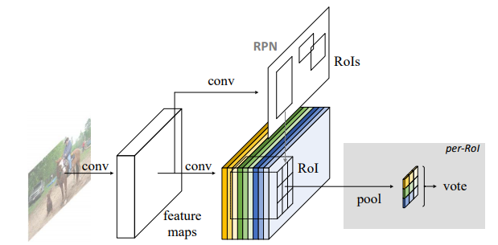

## Object Detection

### 2018
|No.   |Figure   |Title   |Authors  |Pub.  |Links|
|-----|:-----:|:-----:|:-----:|:----:|:---:|
|||**DetNet: A Backbone network for Object Detection**|Zeming Li, Chao Peng, Gang Yu, Xiangyu Zhang, Yangdong Deng, Jian Sun, Tsinghua University & Megvii Inc|Arxiv|[arxiv](https://arxiv.org/abs/1804.06215) [code:none]()|
|||**Cross-Domain Weakly-Supervised Object Detection through Progressive Domain Adaptation**|Naoto Inoue, Ryosuke Furuta, Toshihiko Yamasaki, Kiyoharu Aizawa, The University of Tokyo, Japan |CVPR 2018 | [arxiv]() [github:tensorflow](https://github.com/naoto0804/cross-domain-detection)|
|||**Training Deep Networks with Synthetic Data: Bridging the Reality Gap by Domain Randomization**|Jonathan Tremblay, Aayush Prakash, David Acuna, Mark Brophy, Varun Jampani, Cem Anil, Thang To, Eric Cameracci, Shaad Boochoon, Stan Birchfield, NVIDIA |CVPR 2018 Workshop | [arxiv](https://arxiv.org/abs/1804.06516) [github:none]()|
|||**YOLOv3: An Incremental Improvement**|Naoto Inoue, Ryosuke Furuta, Toshihiko Yamasaki, Kiyoharu Aizawa, University of Washington |arxiv | [arxiv](https://arxiv.org/abs/1804.02767) [github:darknet](https://pjreddie.com/darknet/yolo/)|
### 2017
|No.   |Figure   |Title   |Authors  |Pub.  |Links|
|-----|:-----:|:------:|:-----:|:----:|:---:|
|||**Light-Head R-CNN: In Defense of Two-Stage Object Detector**|Zeming Li, Chao Peng, Gang Yu, Xiangyu Zhang, Yangdong Deng, Jian Sun, Tsinghua University & Megvii Inc|arxiv|[arxiv](https://arxiv.org/abs/1711.07264) [github:tensorflow](https://github.com/zengarden/light_head_rcnn)
|||**Mask R-CNN**|Kaiming He, Georgia Gkioxari, Piotr Dollár, Ross Girshick, Facebook AI Research(FAIR)|ICCV2017(Best Paper)|[arxiv](https://arxiv.org/abs/1703.06870) [github:Detectron:caffe2](https://github.com/facebookresearch/Detectron)
|||**Focal Loss for Dense Object Detection**|Tsung-Yi Lin, Priya Goyal, Ross Girshick, Kaiming He, and Piotr Dollár, Facebook AI Research(FAIR)|ICCV 2017(Best Student Paper)|[arxiv](https://arxiv.org/abs/1708.02002) [github:Detectron:caffe2](https://github.com/facebookresearch/Detectron)
|||**DSSD : Deconvolutional Single Shot Detector**|Cheng-Yang Fu, Wei Liu, Ananth Ranga, Ambrish Tyagi, Alexander C. Berg, UNC Chapel Hill, Amazon Inc|CVPR 2017|[arxiv](https://arxiv.org/abs/1612.03144) [github:caffe](https://github.com/chengyangfu/caffe/tree/dssd)
|||**Feature Pyramid Networks for Object Detection**|Tsung-Yi Lin, Piotr Dollár, Ross Girshick, Kaiming He, Bharath Hariharan, and Serge Belongie, Facebook AI Research(FAIR), Cornell Univercity|CVPR 2017|[arxiv](https://arxiv.org/abs/1612.03144) [github:Detectron:caffe2](https://github.com/facebookresearch/Detectron)
|||**YOLO9000: Better, Faster, Stronger**|Joseph Redmon, Ali Farhadi, University of Washington, Cornell Univercity|CVPR 2017(Best Paper Honorable Mention)|[arxiv](https://arxiv.org/abs/1612.03144) [github:darknet]((https://pjreddie.com/darknet/yolo/)
|||**Speed/accuracy trade-offs for modern convolutional object detectors**|Jonathan Huang, Vivek Rathod, Chen Sun, Menglong Zhu, Anoop Korattikara, Alireza Fathi, Ian Fischer, Zbigniew Wojna, Yang Song, Sergio Guadarrama, Kevin Murphy, Cornell Univercity|CVPR 2017|[arxiv](https://arxiv.org/abs/1611.10012) [github:tf-object-detection API](https://github.com/tensorflow/models/tree/master/research/object_detection)
### 2016
|No.   |Figure   |Title   |Authors  |Pub.  |Links|
|-----|:-----:|:------:|:-----:|:----:|:---:|
|||**SSD: Single Shot MultiBox Detector**|Wei Liu, Dragomir Anguelov, Dumitru Erhan, Christian Szegedy, Scott Reed, Cheng-Yang Fu, Alexander C. Berg, 1UNC Chapel Hill, Zoox Inc., Google Inc., University of Michigan Ann-Arbor|ECCV 2016|[arxiv](https://arxiv.org/abs/1512.02325) [github:caffe](https://github.com/weiliu89/caffe/tree/ssd)
|||**You Only Look Once: Unified, Real_Time Object Detection**|Joseph Redmon, Santosh Divvala, Ross Girshick, Ali Farhadi, University of Washington, Allen Institute for AI, Facebook AI Research(FAIR)|CVPR 2016|[arxiv](https://arxiv.org/abs/1506.02640) [project](https://pjreddie.com/darknet/yolo/) [github:darknet](https://github.com/pjreddie/darknet)
|||**R-FCN: Object Detection via Region-based Fully Convolutional Networks**|Jifeng Dai, Yi Li, Kaiming He, Jian Sun, Tsinghua University & Microsoft Research|NIPS 2016|[arxiv](https://arxiv.org/abs/1605.06409) [github:caffe](https://github.com/daijifeng001/R-FCN)

### ~ 2015
|No.   |Figure   |Title   |Authors  |Pub.  |Links|
|-----|:-----:|:------:|:-----:|:----:|:---:|
|||**Faster R-CNN: Towards Real-Time Object Detection with Region Proposal Networks**|Shaoqing Ren, Kaiming He, Ross Girshick, Jian Sun, Microsoft Research|NIPS 2015|[nips](http://papers.nips.cc/paper/5638-faster-r-cnn-towards-real-time-object-detection-with-region-proposal-networks.pdf5) [arxiv](https://arxiv.org/pdf/1506.01497.pdf) [github:caffe](https://github.com/rbgirshick/py-faster-rcnn)
|||**Fast R-CNN**|Ross Girshick, Microsoft Research|ICCV 2015|[CVF](https://www.cv-foundation.org/openaccess/content_iccv_2015/papers/Girshick_Fast_R-CNN_ICCV_2015_paper.pdf) [github:caffe](https://github.com/rbgirshick/fast-rcnn)
|||**Rich feature hierarchies for accurate object detection and semantic segmentation**|Ross Girshick, Jeff Donahue, Trevor Darrell, Jitendra Malik, UC Berkeley|NIPS 2015|[CVF](https://www.cv-foundation.org/openaccess/content_cvpr_2014/papers/Girshick_Rich_Feature_Hierarchies_2014_CVPR_paper.pdf) [github:caffe](https://github.com/rbgirshick/rcnn)
