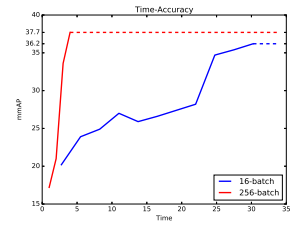
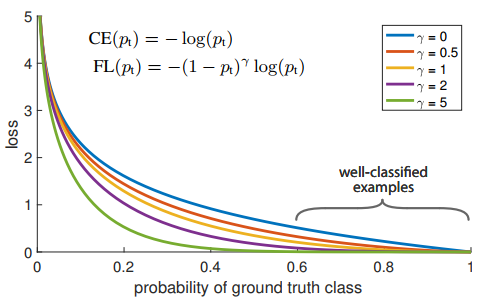

## Object Detection

|Method   |backbon   |AP	|AP_50|AP_S|AP_M|AP_L  |Speed|
|-----|:-----:|:-----:|:-----:|:----:|:---:|
|FRCNN | ResNet-101| 32.1 || 12.8 | 34.9 | 46.1|7FPS(TitanX)|
|SSD300| VGG16|25.1|43.1||||46FPS(Titan X)
|SSD512| VGG16|28.8|48.5||||19FPS(Titan X)
|DSSD513| ResNet-101 | 33.2|59.1 | 13.0 | 35.4|51.1
|YOLOv2| Darknet-19 | 21.6 | 44.0|5.0|22.4|35.5|
|YOLOv3 320| Darknet-53 | 28.2 | 51.5||||22ms(Titan X)
|YOLOv3 416| Darknet-53 | 31.0 | 55.3||||29ms(Titan X)
|YOLOv3 608| Darknet-53 | 33.0 | 57.9|18.3|35.4|41.9|51ms(Titan X)
|R-FCN | Resnet-101|32.1||12.8|34.9|46.1|
|RetinaNet | Resnet-101-FPN | 39.1 | 59.1 | 21.8 | 42.7 | 50.2 |
|| Resnext-101-FPN | 40.8 | 61.1 | 24.1 | 44.2 | 51.2 |
|FRCNN-FPN | Resnet-101-FPN | 36.2 | 59.1 | 18.2 | 39.0 | 48.2 |
|Mask-RCNN | Resnet-101-FPN | 38.2 | 60.3 | 20.1 | 41.1 | 50.2 |
||ResNeXt-101-FPN|39.8|62.3|22.1|43.2|51.2|
|LightHead RCNN |Resnet-101 | 39.5||21.8|43.0|50.7
||Renset-101-FPN|41.5||25.2|45.3|53.1|
|NasNet(FRCNN) | Nasnet-A(6@4032) | 43.1 |  |  |  |  |
|DetNet(FRCNN) | Detnet-59-FPN | 40.3 | 62.1 | 23.6 | 42.6 | 50.0 |

### Resources
|No.   |Algorithm     |Title  ||Date|
|-----|:-----:|:-----:|:-----:|:----:|:---:|
||Faster R-CNN|
||SSD|[Understanding SSD MultiBox — Real-Time Object Detection In Deep Learning](https://towardsdatascience.com/understanding-ssd-multibox-real-time-object-detection-in-deep-learning-495ef744fab)||2017.11.18|
||YOLO|[What’s new in YOLO v3?](https://towardsdatascience.com/yolo-v3-object-detection-53fb7d3bfe6b)||2018.04.23|
|||[How to implement a YOLO (v3) object detector from scratch in PyTorch. Part1~5](https://blog.paperspace.com/how-to-implement-a-yolo-object-detector-in-pytorch/)|[github](https://github.com/ayooshkathuria/YOLO_v3_tutorial_from_scratch)|2018.04.16|
|||[Bounding box object detectors: understanding YOLO](http://christopher5106.github.io/object/detectors/2017/08/10/bounding-box-object-detectors-understanding-yolo.html)||2017.08.10|
||Mask R-CNN|
||RetinaNet|[The intuition behind RetinaNet](https://medium.com/@14prakash/the-intuition-behind-retinanet-eb636755607d)||2018.03.24|
||Detectron|[Detectron Transfer Learning with PASCAL VOC 2007 dataset](https://medium.com/@royhuang_87663/detectron-transfer-learning-with-pascal-voc-2007-dataset-73bacf43dfbd)|[github](https://github.com/royhuang9/Detectron)|2018.02.16|
|||[Detectron Example](https://zhuanlan.zhihu.com/p/34036460)||2018.03.24|
||Utils|[Pascal_VOC(xml) to COCO(json) python code](https://github.com/CivilNet/Gemfield/blob/master/src/python/pascal_voc_xml2json/pascal_voc_xml2json.py)
||Survey|[handong object detection resources](https://github.com/handong1587/handong1587.github.io/blob/master/_posts/deep_learning/2015-10-09-object-detection.md)

### Datasets

### 2018
|No.   |Figure   |Title   |Authors  |Pub.  |Links|
|-----|:-----:|:-----:|:-----:|:----:|:---:|
|||**DetNet: A Backbone network for Object Detection**|Zeming Li, Chao Peng, Gang Yu, Xiangyu Zhang, Yangdong Deng, Jian Sun,  Tsinghua University & Megvii Inc|Arxiv|[arxiv](https://arxiv.org/abs/1804.06215)  [code:none]()|
|||**Cross-Domain Weakly-Supervised Object Detection through Progressive Domain Adaptation**|Naoto Inoue, Ryosuke Furuta, Toshihiko Yamasaki, Kiyoharu Aizawa,  The University of Tokyo, Japan |CVPR 2018 | [arxiv](https://arxiv.org/abs/1803.11365)  [github:tensorflow](https://github.com/naoto0804/cross-domain-detection)|
|||**MegDet: A Large Mini-Batch Object Detector**|Chao Peng, Tete Xiao, Zeming Li, Yuning Jiang, Xiangyu Zhang, Kai Jia, Gang Yu, Jian Sun,  Peking University, Tsinghua University & Megvii Inc |CVPR 2018 | [arxiv](https://arxiv.org/abs/1711.07240v1)  [code:none]()|
|||**Training Deep Networks with Synthetic Data: Bridging the Reality Gap by Domain Randomization**|Jonathan Tremblay, Aayush Prakash, David Acuna, Mark Brophy, Varun Jampani, Cem Anil, Thang To, Eric Cameracci, Shaad Boochoon, Stan Birchfield,  NVIDIA |CVPR 2018 Workshop | [arxiv](https://arxiv.org/abs/1804.06516)  [github:none]()|
|||**YOLOv3: An Incremental Improvement**|Naoto Inoue, Ryosuke Furuta, Toshihiko Yamasaki, Kiyoharu Aizawa,  University of Washington |arxiv | [arxiv](https://arxiv.org/abs/1804.02767)  [github:darknet](https://pjreddie.com/darknet/yolo/)|

### 2017
|No.   |Figure   |Title   |Authors  |Pub.  |Links|
|-----|:-----:|:------:|:-----:|:----:|:---:|
|||**COCO Challenges 2017**|||[site](https://places-coco2017.github.io/#schedule) 
|||**Light-Head R-CNN: In Defense of Two-Stage Object Detector**|[Zeming Li](http://www.zemingli.com/), Chao Peng, Gang Yu, Xiangyu Zhang, Yangdong Deng, Jian Sun,  Tsinghua University & Megvii Inc|arxiv|[arxiv](https://arxiv.org/abs/1711.07264)  [github:tensorflow](https://github.com/zengarden/light_head_rcnn)
|||**Mask R-CNN**|Kaiming He, Georgia Gkioxari, Piotr Dollár, Ross Girshick, Facebook AI Research(FAIR)|ICCV2017(Best Paper)|[arxiv](https://arxiv.org/abs/1703.06870)  [github:Detectron:caffe2](https://github.com/facebookresearch/Detectron)
|||**Focal Loss for Dense Object Detection**|Tsung-Yi Lin, Priya Goyal, Ross Girshick, Kaiming He, and Piotr Dollár,  Facebook AI Research(FAIR)|ICCV 2017(Best Student Paper)|[arxiv](https://arxiv.org/abs/1708.02002)  [github:Detectron:caffe2](https://github.com/facebookresearch/Detectron)
|||**Deformable Convolutional Networks**|Deformable Convolutional Networks,  Microsoft Research|ICCV 2017|[arxiv](https://arxiv.org/abs/1703.06211)  [github:mxnet](https://github.com/msracver/Deformable-ConvNets)
|||**DSSD : Deconvolutional Single Shot Detector**|Cheng-Yang Fu, Wei Liu, Ananth Ranga, Ambrish Tyagi, Alexander C. Berg,  UNC Chapel Hill, Amazon Inc|CVPR 2017|[arxiv](https://arxiv.org/abs/1612.03144)  [github:caffe](https://github.com/chengyangfu/caffe/tree/dssd)
|||**Feature Pyramid Networks for Object Detection**|Tsung-Yi Lin, Piotr Dollár, Ross Girshick, Kaiming He, Bharath Hariharan, and Serge Belongie, Facebook AI Research(FAIR), Cornell Univercity|CVPR 2017|[arxiv](https://arxiv.org/abs/1612.03144)  [github:Detectron:caffe2](https://github.com/facebookresearch/Detectron)
|||**YOLO9000: Better, Faster, Stronger**|Joseph Redmon, Ali Farhadi,  University of Washington, Cornell Univercity|CVPR 2017(Best Paper Honorable Mention)|[arxiv](https://arxiv.org/abs/1612.03144)  [github:darknet]((https://pjreddie.com/darknet/yolo/)
|||**Speed/accuracy trade-offs for modern convolutional object detectors**|Jonathan Huang, Vivek Rathod, Chen Sun, Menglong Zhu, Anoop Korattikara, Alireza Fathi, Ian Fischer, Zbigniew Wojna, Yang Song, Sergio Guadarrama, Kevin Murphy,  Cornell Univercity|CVPR 2017|[arxiv](https://arxiv.org/abs/1611.10012)  [github:tf-object-detection API](https://github.com/tensorflow/models/tree/master/research/object_detection)
### 2016
|No.   |Figure   |Title   |Authors  |Pub.  |Links|
|-----|:-----:|:------:|:-----:|:----:|:---:|
|||**SSD: Single Shot MultiBox Detector**|Wei Liu, Dragomir Anguelov, Dumitru Erhan, Christian Szegedy, Scott Reed, Cheng-Yang Fu, Alexander C. Berg,  UNC Chapel Hill, Zoox Inc., Google Inc., University of Michigan Ann-Arbor|ECCV 2016|[arxiv](https://arxiv.org/abs/1512.02325)  [github:caffe](https://github.com/weiliu89/caffe/tree/ssd)
|||**You Only Look Once: Unified, Real_Time Object Detection**|Joseph Redmon, Santosh Divvala, Ross Girshick, Ali Farhadi,  University of Washington, Allen Institute for AI, Facebook AI Research(FAIR)|CVPR 2016|[arxiv](https://arxiv.org/abs/1506.02640)  [project](https://pjreddie.com/darknet/yolo/)  [github:darknet](https://github.com/pjreddie/darknet)
|||**R-FCN: Object Detection via Region-based Fully Convolutional Networks**|Jifeng Dai, Yi Li, Kaiming He, Jian Sun,  Tsinghua University & Microsoft Research|NIPS 2016|[arxiv](https://arxiv.org/abs/1605.06409)  [github:caffe](https://github.com/daijifeng001/R-FCN)

### ~ 2015
|No.   |Figure   |Title   |Authors  |Pub.  |Links|
|-----|:-----:|:------:|:-----:|:----:|:---:|
|||**Faster R-CNN: Towards Real-Time Object Detection with Region Proposal Networks**|Shaoqing Ren, Kaiming He, Ross Girshick, Jian Sun,  Microsoft Research|NIPS 2015|[nips](http://papers.nips.cc/paper/5638-faster-r-cnn-towards-real-time-object-detection-with-region-proposal-networks.pdf5) [arxiv](https://arxiv.org/pdf/1506.01497.pdf)  [github:caffe](https://github.com/rbgirshick/py-faster-rcnn)
|||**Fast R-CNN**|Ross Girshick,  Microsoft Research|ICCV 2015|[CVF](https://www.cv-foundation.org/openaccess/content_iccv_2015/papers/Girshick_Fast_R-CNN_ICCV_2015_paper.pdf)  [github:caffe](https://github.com/rbgirshick/fast-rcnn)
|||**Rich feature hierarchies for accurate object detection and semantic segmentation**|Ross Girshick, Jeff Donahue, Trevor Darrell, Jitendra Malik,  UC Berkeley|NIPS 2015|[CVF](https://www.cv-foundation.org/openaccess/content_cvpr_2014/papers/Girshick_Rich_Feature_Hierarchies_2014_CVPR_paper.pdf)  [github:caffe](https://github.com/rbgirshick/rcnn)
